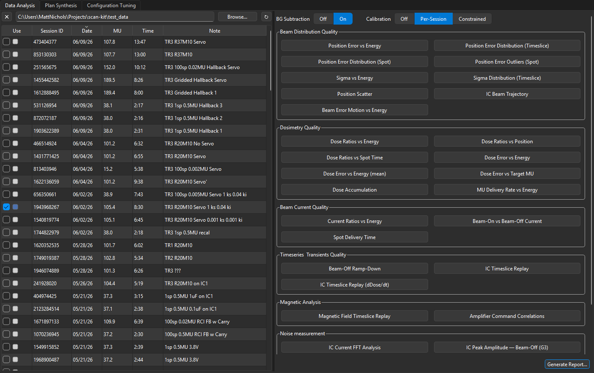
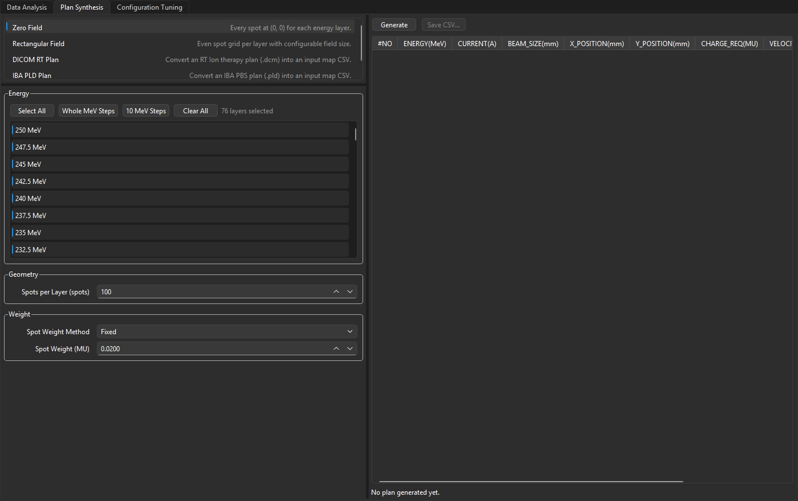
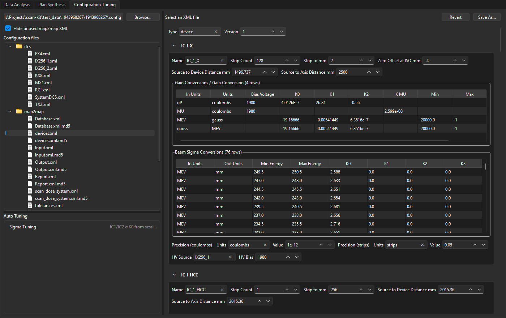
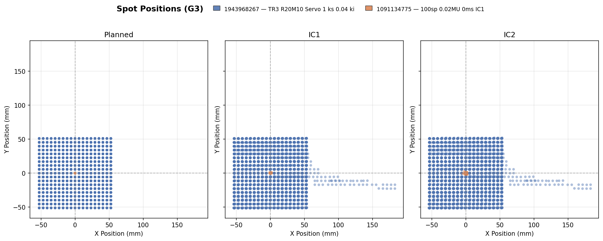
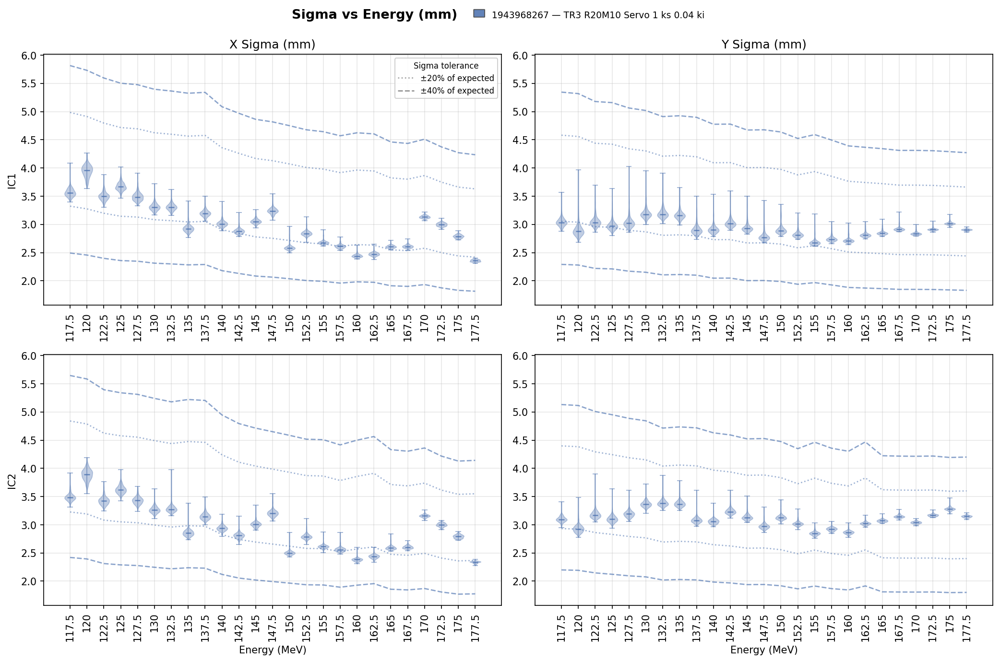
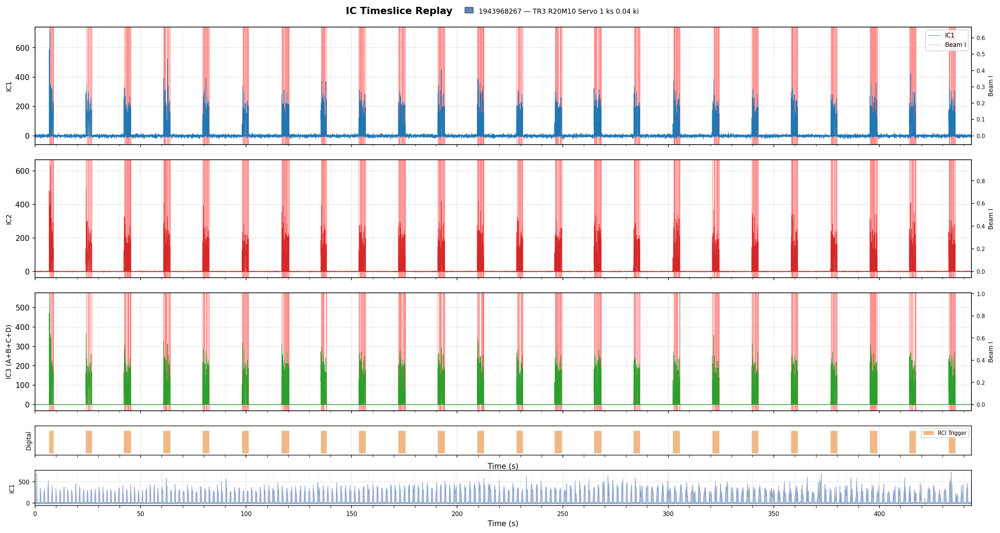
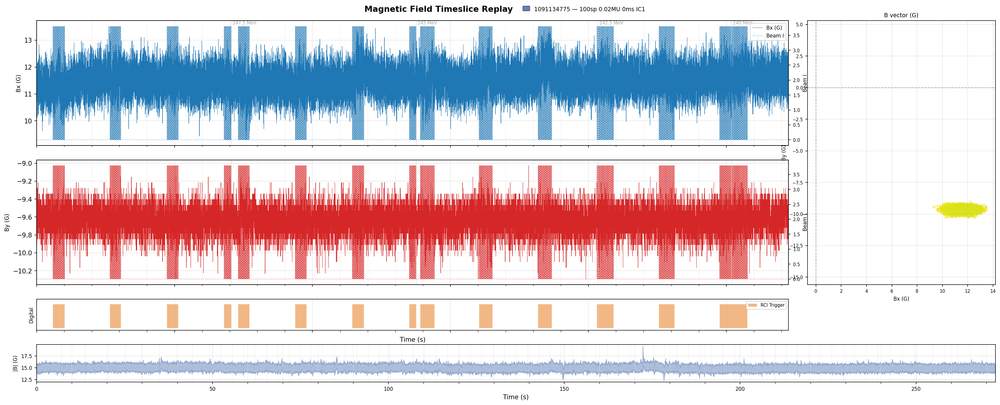
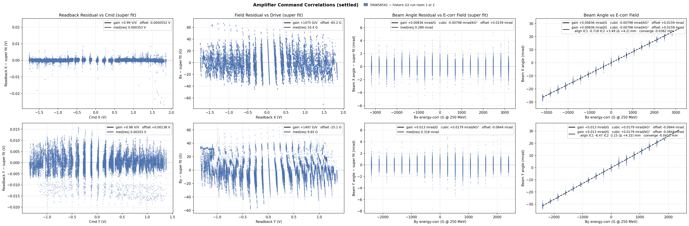

<p align="center">
  
</p>

<h1 align="center">Scan Kit</h1>

<p align="center">
  <strong>Open-source analysis for proton pencil beam scanning sessions.</strong><br>
  Explore beam quality, dosimetry, magnetics, and delivery logs — from a single desktop launcher.
</p>

<p align="center">
  <a href="LICENSE"></a>
  <a href="https://github.com/Pyramid-Technical-Consultants/scan-kit/releases/latest"></a>
  
</p>

<p align="center">
  <a href="#the-launcher">
    
  </a>
  <br>
  <sub><em>Session browser, calibration controls, and one-click access to every analysis view.</em></sub>
</p>

---

## Contents

- [What Scan Kit does](#what-scan-kit-does)
- [Get started](#get-started)
- [Screenshots](#screenshots)
- [The launcher](#the-launcher)
- [Data Analysis](#data-analysis)
- [Analysis views](#analysis-views)
- [Plan Synthesis](#plan-synthesis)
- [Configuration Tuning](#configuration-tuning)
- [Session data layout](#session-data-layout)
- [For developers](#for-developers)
- [License](#license)

## What Scan Kit does

Scan Kit is a desktop toolkit for reviewing PBS treatment and QA sessions. Point it at a folder of session data, select up to five sessions, and launch Matplotlib analysis views — each in its own process so the launcher stays responsive.

Beyond plotting, Scan Kit helps you:

| Capability | What you get |
|------------|--------------|
| **Session comparison** | Overlay multiple sessions in the same view with distinct colors |
| **Interactive replay** | Scrub through IC current and magnetic-field timeslices like a media player |
| **PDF reports** | Bundle static plots into a shareable analysis report |
| **Plan authoring** | Generate `input_map.csv` from templates, DICOM RT Ion plans, or IBA PLD files |
| **Config editing** | Browse and edit map2map XML with forms, integrity checks, and sigma auto-tuning |

Scan Kit reads standard DCS session exports — unpacked directories or common archive formats — and works with both G2 and G3 data layouts.

## Get started

### Download a release (recommended)

Pre-built executables are published on [**GitHub Releases**](https://github.com/Pyramid-Technical-Consultants/scan-kit/releases/latest). No Python install required.

| Platform | Download |
|----------|----------|
| **Windows** | `scan-kit-windows-{version}.exe` |
| **Linux** (x86-64) | `scan-kit-linux-amd64-{version}` |

The `{version}` in the filename matches the release tag — e.g. `1.4.0` for tag `v1.4.0`. Run the executable and set your data source folder in the launcher.

> **Trying the latest `main` branch?** CI builds release-candidate artifacts on every push and pull request:
> `scan-kit-windows-{version}-rc.exe` and `scan-kit-linux-amd64-{version}-rc`.
> Download them from the **Artifacts** section of the corresponding [GitHub Actions](https://github.com/Pyramid-Technical-Consultants/scan-kit/actions) workflow run.

### Install from source

Requires **Python 3.10+**.

```bash
git clone https://github.com/Pyramid-Technical-Consultants/scan-kit.git
cd scan-kit
pip install .          # standard install
# pip install -e .     # editable install for development
```

Launch:

```bash
scan-kit
# or: python -m scan_kit
scan-kit --version     # print installed version
```

On a dev install, the default data source is the bundled `test_data/` folder.

## Screenshots

| Data Analysis | Plan Synthesis | Configuration Tuning |
|:---:|:---:|:---:|
| [](docs/images/launcher-data-analysis.png) | [](docs/images/launcher-plan-synthesis.png) | [](docs/images/launcher-config-tuning.png) |
| Browse sessions and launch views | Build and export `input_map.csv` | Edit `devices.xml` and run auto-tuning |

<p align="center">
  
  &nbsp;&nbsp;
  
  <br>
  <sub><em>Spot position scatter (multi-session overlay) and sigma-vs-energy QA plots.</em></sub>
</p>

<p align="center">
  
  <br>
  <sub><em>IC Timeslice Replay — scrub through beam-on current with a timeline brush.</em></sub>
</p>

<p align="center">
  
  &nbsp;
  
  <br>
  <sub><em>Magnetic field replay (G3 hall probes) and amplifier command correlations (G2 steering chain).</em></sub>
</p>

## The launcher

Scan Kit opens a single window with three tabs:

| Tab | Use it to… |
|-----|------------|
| **Data Analysis** | Browse sessions, adjust global plot settings, open analysis views, generate PDF reports |
| **Plan Synthesis** | Create PBS test plans and export `input_map.csv` |
| **Configuration Tuning** | Open a facility or session config folder, edit XML, run tuning workflows |

Plot windows open separately. Close them when you are done — the launcher keeps running. Press **Esc** or **Ctrl+Q** to quit.

## Data Analysis

### 1. Choose your data source

Enter the folder that contains session data in **DATA SOURCE**, then press **Enter** or click away to refresh discovery. When running a frozen executable, the default is the current working directory.

### 2. Select sessions

The session table shows **Session ID**, **Date**, **MU**, **Time (s)**, and **Note**.

- Sort by **Date** (newest first), **ID**, or **MU**
- Tick **Use** on up to **five** sessions — no modifier key needed
- Click **✕** to clear all selections
- **Right-click** a session → **Open in Config Tuning…** when a config folder is available

### 3. Annotate sessions (optional)

Double-click (or press **F2** on) the **Note** column to add free-text notes. Notes save automatically and are stored in `<data_source>/session_notes.json`.

### 4. Tune global settings

Two controls affect most dose-related views:

| Setting | Options |
|---------|---------|
| **Background subtract** | On / Off |
| **Calibration** | Off · Per-Session · Constrained |

Settings persist in `<data_source>/settings.json` and propagate to views that are already open.

### 5. Open analysis views

Click any button in the right-hand panel. Views are grouped by analysis category (see [Analysis views](#analysis-views)). Each view runs in a background subprocess; a warm worker pool makes the first click feel snappy.

### 6. Generate a PDF report (optional)

With sessions selected, click **Generate Report…** to open the report wizard. Pick which views to include, set author metadata, and choose an output path.

Interactive tools — timeslice replay, session log browser, and audio export — are excluded from reports because they cannot be rendered as static pages.

## Analysis views

Views are organized in the launcher to match clinical QA workflows. Select one or more sessions, then click a view to open it.

### Beam distribution

How well does the beam land where the plan says it should?

| View | Summary |
|------|---------|
| Position Error vs Energy | IC1/IC2 X and Y position error vs beam energy |
| Position Error Distribution (Timeslice) | Beam-on timeslice error density contours and histograms |
| Position Error Distribution (Spot) | Per-spot error density contours and histograms |
| Position Error Outliers (Spot) | Spots that are statistical outliers (median/MAD) |
| Sigma vs Energy | IC1/IC2 spot size (σ) in X and Y vs energy |
| Sigma Distribution (Timeslice) | Beam-on timeslice σ density contours and histograms |
| Position Scatter | Planned, IC1, and IC2 positions overlaid by session |
| IC Beam Trajectory | Per-spot IC beam path in X and Y along the beam axis |
| Beam Error Motion vs Energy | Per-energy position-error spill paths (IC1 solid, IC2 dotted) |

### Dosimetry

Are chambers consistent, and is delivered dose on target?

| View | Summary |
|------|---------|
| Dose Ratios vs Energy | IC2/IC1, IC3/IC1, IC3/IC2 ratios vs energy |
| Dose Ratios vs Position | Inter-chamber ratio consistency vs beam position |
| Dose Ratios vs Spot Time | Inter-chamber ratios vs spot delivery time |
| Dose Error vs Energy | Percent dose error vs prescribed target by energy |
| Dose Error vs Energy (mean) | Mean percent dose error per energy layer |
| Dose Error vs Target MU | Per-spot percent dose error vs target MU |
| Dose Accumulation | Expected vs measured cumulative dose per chamber |
| MU Delivery Rate vs Energy | Effective MU/s vs energy (wall-clock per layer) |

### Beam current & timing

| View | Summary |
|------|---------|
| Current Ratios vs Energy | Beam-on mean IC current ratios vs energy |
| Beam-On vs Beam-Off Current | Beam-on and beam-off current distributions by energy |
| Spot Delivery Time | Total, beam-on, and overhead time per spot |

### Timeseries & transients

| View | Summary |
|------|---------|
| Beam-Off Ramp-Down | Beam-off current ramp-down curves (IC1/IC2/IC3) |
| IC Timeslice Replay | Interactive IC1/IC2/IC3 current viewer — [details](#interactive-replay-views) |
| IC Timeslice Replay (dDose/dt) | IC current derived from scan-total dose rate |

### Magnetic analysis

| View | Summary |
|------|---------|
| Magnetic Field Timeslice Replay | Interactive Bx/By field viewer — [details](#interactive-replay-views) |
| Amplifier Command Correlations | Settled amplifier command vs readback, field, and IC position — [details](#amplifier-command-correlations) |

### Noise measurement

| View | Summary |
|------|---------|
| IC Current FFT Analysis | Frequency-domain view of IC1/IC2/IC3 current |
| IC Peak Amplitude — Beam-Off (G3) | G3 beam-off peak amplitude distributions |
| IC Audio Export (WAV) | Listen to and export IC waveforms as WAV *(requires PortAudio)* |

### Session log

| View | Summary |
|------|---------|
| Session Log Compare | Layer timings, grouped errors, event browser, two-session diff — [details](#session-log-compare) |

### Interactive replay views

**IC Timeslice Replay** and **Magnetic Field Timeslice Replay** share a media-player layout — detail traces on top, a compressed timeline brush below. See the [screenshots](#screenshots) for examples.

1. Select session(s) and open the replay view.
2. The bottom timeline shows a compressed envelope of the full session.
3. Click and drag to define the window displayed in the detail panel above.

Layer boundaries appear as annotated vertical lines. Multiple sessions overlay with distinct colors. Large windows are auto-decimated so scrubbing stays smooth.

**Magnetic field** replay plots scan-magnet probes in gauss:

- **G3:** `r_tx2_probe_x` / `r_tx2_probe_y` (TX2 hall probes)
- **G2:** `field_c_x` / `field_c_y` (correcting-coil readback)

A Bx-vs-By scatter panel (colored by energy) accompanies the timeline view.

### Amplifier command correlations

For G2 correcting-coil sessions, this view plots beam-on samples where amplifier commands have reached a settled plateau. Scatter panels relate command to readback, magnetic field, and IC iso position — useful for diagnosing steering-chain consistency end to end.

### Session log compare

Every session ships a verbose `SessionLogFile.log` from DCS. This view distills it:

1. Select **one** session to explore, or **two** to compare.
2. **Layer timeline** — `START MAP` and `SCAN EXECUTING` durations per layer.
3. **Issues** — grouped `ERROR` templates and watchdog mismatches.
4. **Event browser** — filterable log with *Hide noise* to skip ACK/command chatter.
5. **Message diff** *(two sessions)* — templates whose occurrence counts differ most.

## Plan Synthesis

Switch to the **Plan Synthesis** tab to build `input_map.csv` files for PBS test plans.

| Template | Description |
|----------|-------------|
| **Zero Field** | Every spot at (0, 0) for each energy layer |
| **Rectangular Field** | Even spot grid per layer with configurable field size |
| **DICOM RT Plan** | Import an RT Ion therapy plan (`.dcm`) |
| **IBA PLD Plan** | Import an IBA PBS plan (`.pld`) |

Pick a template, set parameters, preview the spot table, and export. Suggested filenames are generated from the template and energy settings.

<p align="center">
  
</p>

## Configuration Tuning

The **Configuration Tuning** tab is a structured editor for map2map XML configuration:

- **File tree** — browse `devices.xml` and related config files
- **Auto-generated forms** — edit XML values without raw markup
- **Hide unused map2map XML** — collapse attributes the map2map library never reads
- **Integrity badges** — SHA-256 sidecar verification at a glance
- **Auto-tuning workflows** — e.g. **Sigma Tuning** derives updated IC σ K0 values from measured sessions, with preview before apply

Jump here directly from a session's context menu in Data Analysis when an on-disk config folder exists.

<p align="center">
  
</p>

## Session data layout

Scan Kit discovers sessions from a single data-source folder. Supported layouts:

**Unpacked directories**

```
<data_source>/
  <session_id>/
    input_map.csv
    SessionLogFile.log          # optional — session log views
    layer-<n>/run-<m>/
      timeslice_data_device_units.csv   # timeslice views
```

A nested layout (`<session_id>/<session_id>/input_map.csv`) is also recognized.

**Archive files** — each archive should contain a top-level `<session_id>/` folder:

`.zip` · `.tgz` · `.tar.gz` · `.tar.bz2` · `.tar.xz` · `.tar`

---

## For developers

<details>
<summary><strong>Regenerating README screenshots</strong></summary>

Screenshots in `docs/images/` are captured from real session data with:

```bash
python scripts/capture_doc_screenshots.py
```

Requires a local `test_data/` folder (not shipped with the repo). The script grabs launcher tabs off-screen and renders analysis views headlessly.

</details>

<details>
<summary><strong>Running tests</strong></summary>

```bash
pip install -e ".[build]"
pytest
```

Tests live in `tests/` and use fixtures from `test_data/` (included in dev installs, excluded from the published package). The suite runs headless — Agg matplotlib backend, no Qt windows.

App preferences (last data directory, report paths, window geometry) persist in `app_settings.json` under the user config directory.

</details>

<details>
<summary><strong>Building an executable locally</strong></summary>

```bash
pip install -e ".[build]"
python build.py --clean      # single-file executable → dist/
python build.py --onedir     # faster one-directory bundle for iteration
```

Output: `dist/scan-kit` (Linux) or `dist/scan-kit.exe` (Windows). Local builds keep these generic names; CI release assets include the version suffix.

</details>

<details>
<summary><strong>Cutting a release</strong></summary>

Releases are automated via [`.github/workflows/build.yml`](.github/workflows/build.yml).

1. Bump `__version__` in `scan_kit/__init__.py` — the single source of truth, also read by `pyproject.toml` and the window title.
2. Commit: `Release vX.Y.Z`, push to `main`.
3. Tag and push:

```bash
git tag vX.Y.Z
git push origin vX.Y.Z
```

| Trigger | CI output |
|---------|-----------|
| Push to `main`, PR, manual dispatch | `-rc` artifacts (`scan-kit-windows-X.Y.Z-rc.exe`, etc.) |
| `v*` tag push | GitHub Release with `scan-kit-windows-X.Y.Z.exe` and `scan-kit-linux-amd64-X.Y.Z` |

CI verifies the tag matches `__version__` before publishing. The project follows [Semantic Versioning](https://semver.org/).

</details>

## License

[MIT](LICENSE) — Copyright (c) 2026 Pyramid Technical Consultants
