<p align="center">
  
</p>

<h1 align="center">Scan Kit</h1>

<p align="center">
  <strong>Open-source analysis for proton pencil beam scanning sessions.</strong><br>
  Explore beam quality, dosimetry, magnetics, and delivery logs from a single desktop launcher.
</p>

<p align="center">
  <a href="LICENSE"></a>
  <a href="https://github.com/Pyramid-Technical-Consultants/scan-kit/releases/latest"></a>
  
</p>

<p align="center">
  <a href="#the-launcher">
    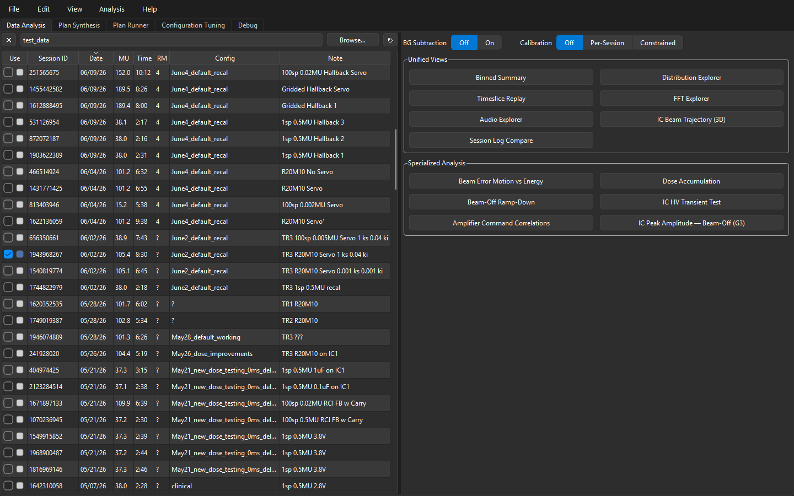
  </a>
  <br>
  <sub><em>Session browser, plot calibration, and one-click access to every analysis view.</em></sub>
</p>

---

## Contents

- [What Scan Kit does](#what-scan-kit-does)
- [Get started](#get-started)
- [Screenshots](#screenshots)
- [The launcher](#the-launcher)
- [Data Analysis](#data-analysis)
- [Analysis views](#analysis-views)
- [Plan Synthesis](#plan-synthesis)
- [Plan Runner](#plan-runner)
- [Configuration Tuning](#configuration-tuning)
- [Session data layout](#session-data-layout)
- [For developers](#for-developers)
- [License](#license)

## What Scan Kit does

Scan Kit is a desktop toolkit for reviewing PBS treatment and QA sessions. Point it at a folder of session data, select up to five sessions, and launch analysis views, each in its own process so the launcher stays responsive.

Beyond plotting, Scan Kit helps you:

| Capability | What you get |
|------------|--------------|
| **Session comparison** | Overlay multiple sessions in the same view with distinct colors |
| **Interactive replay** | Scrub timeslice channels (IC, dDose/dt, sigma, field) in one Qt viewer |
| **Plan authoring** | Generate `input_map.csv` from templates, DICOM RT Ion plans, or IBA PLD files |
| **Plan delivery** | Upload a plan to an RCI, run it, and download the session as a G3 zip |
| **Config editing** | Browse and edit map2map XML with forms, integrity checks, and auto-tuning |

Scan Kit reads standard DCS session exports (unpacked directories or common archive formats) and works with both G2 and G3 data layouts.

## Get started

### Download a release (recommended)

Pre-built executables are published on [**GitHub Releases**](https://github.com/Pyramid-Technical-Consultants/scan-kit/releases/latest). No Python install required.

| Platform | Download |
|----------|----------|
| **Windows** | `scan-kit-windows-{version}.exe` |
| **Linux** (x86-64) | `scan-kit-linux-amd64-{version}.AppImage` |

**Linux:** download the `.AppImage`, mark it executable (`chmod +x`), then double-click it (Ubuntu may ask you to trust/launch it once). On first launch it registers itself in your applications menu with the correct icon.

> **Trying the latest `main` or `develop` branch?** CI builds release-candidate artifacts on every merge to those branches (not on open pull requests):
> `scan-kit-windows-{version}-rc.exe` and `scan-kit-linux-amd64-{version}-rc.AppImage`.
> Download them from the **Artifacts** section of the corresponding [GitHub Actions](https://github.com/Pyramid-Technical-Consultants/scan-kit/actions) workflow run.

### Install from source

Requires **Python 3.10+**.

```bash
git clone https://github.com/Pyramid-Technical-Consultants/scan-kit.git
cd scan-kit
pip install .          # standard install
# pip install -e .     # editable install for development
```

Launch:

```bash
scan-kit
# or: python -m scan_kit
scan-kit --version     # print installed version
```

On a dev install, the default data source is the bundled `test_data/` folder.

## Screenshots

| Data Analysis | Plan Synthesis |
|:---:|:---:|
| [](docs/images/launcher-data-analysis.png) | [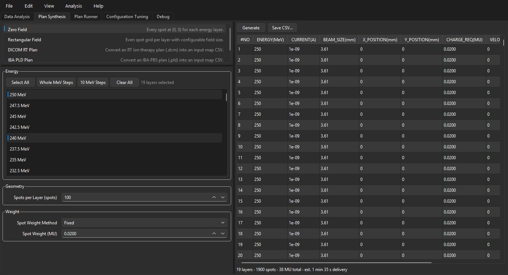](docs/images/launcher-plan-synthesis.png) |
| Browse sessions and launch views | Build and export `input_map.csv` |

| Plan Runner | Configuration Tuning |
|:---:|:---:|
| [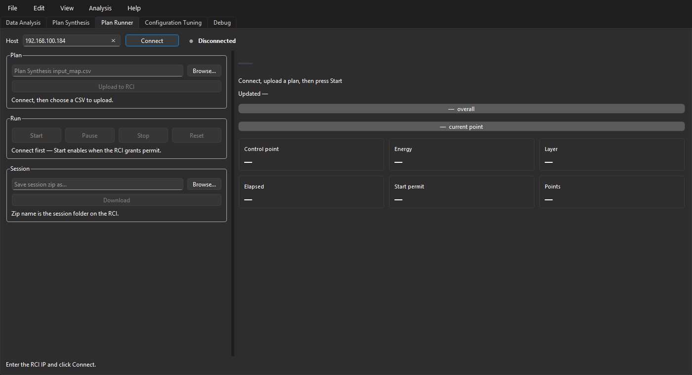](docs/images/launcher-plan-runner.png) | [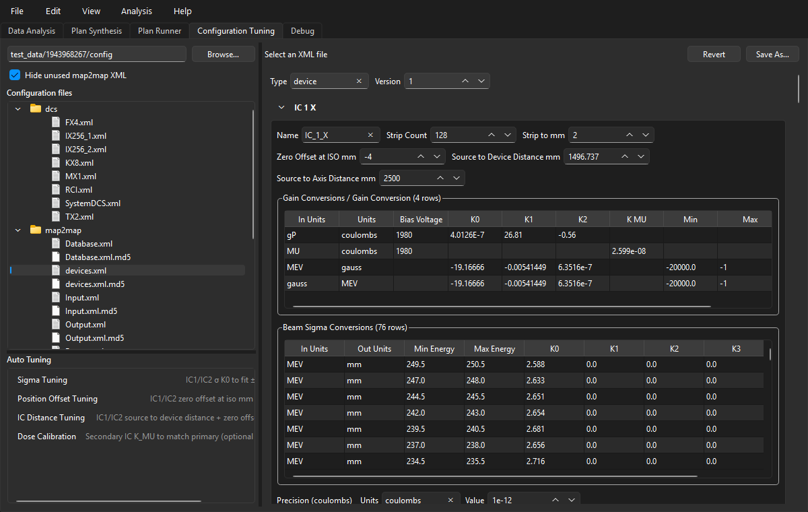](docs/images/launcher-config-tuning.png) |
| Upload a plan to an RCI and download the session | Edit `devices.xml` and run auto-tuning |

<p align="center">
  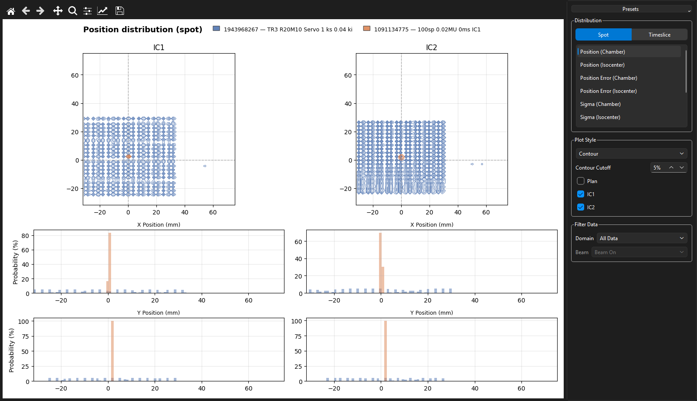
  &nbsp;&nbsp;
  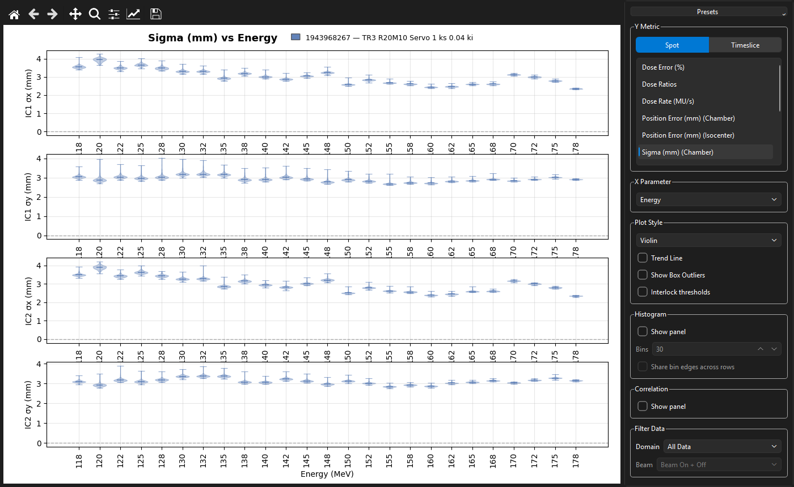
  <br>
  <sub><em>Distribution Explorer (spot positions) and Binned Summary (sigma vs energy), each with a live side panel.</em></sub>
</p>

<p align="center">
  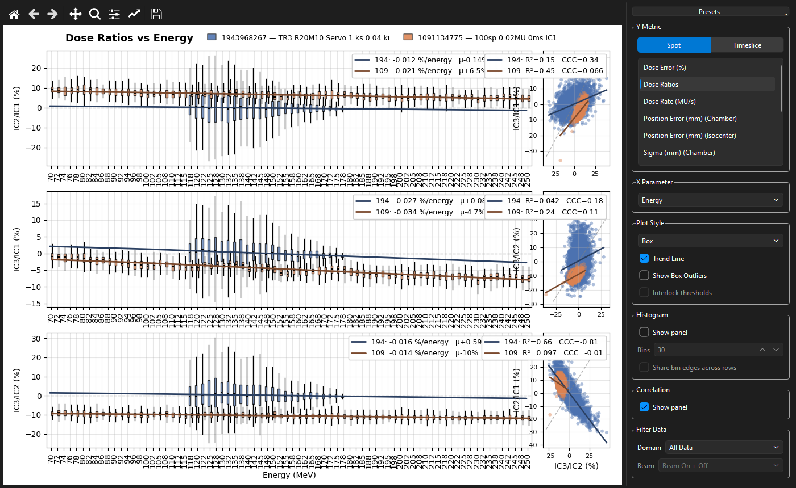
  <br>
  <sub><em>Binned Summary: dose ratios vs energy, with optional correlation panels for multi-session overlay.</em></sub>
</p>

<p align="center">
  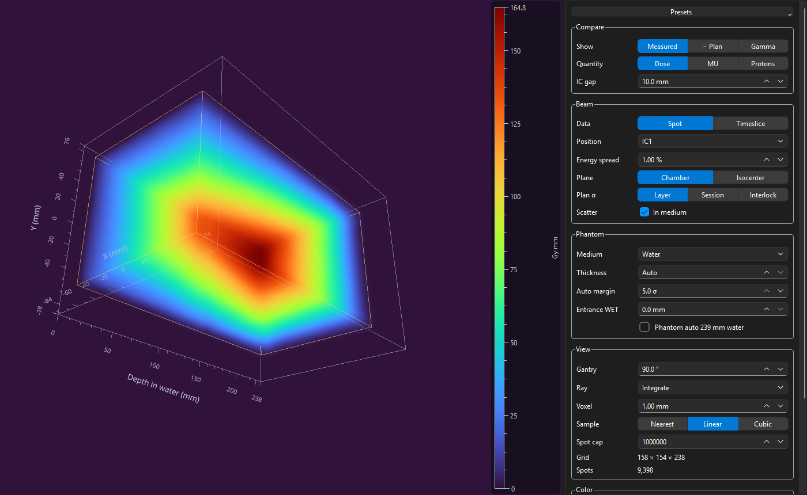
  <br>
  <sub><em>Dose Volume (3D): measured dose in the phantom, with field bounds and the comparison sidebar.</em></sub>
</p>

<p align="center">
  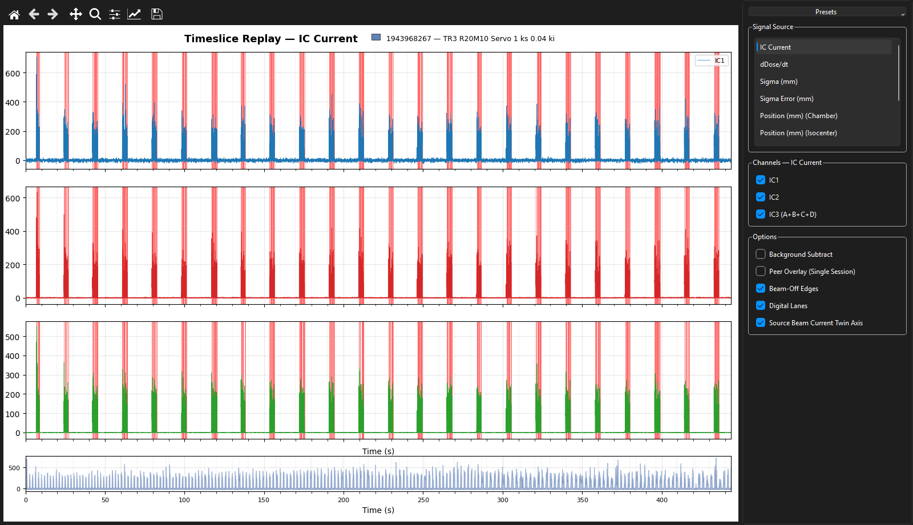
  <br>
  <sub><em>Timeslice Replay: pick a signal source, tick channels, and scrub the timeline brush.</em></sub>
</p>

<p align="center">
  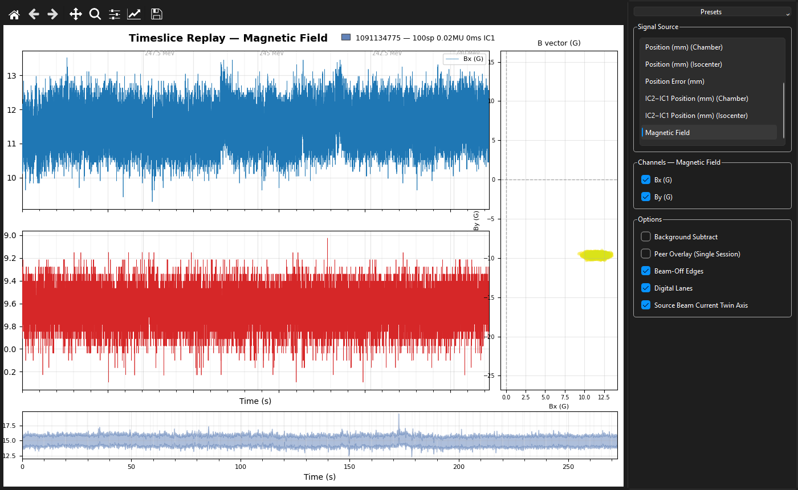
  &nbsp;
  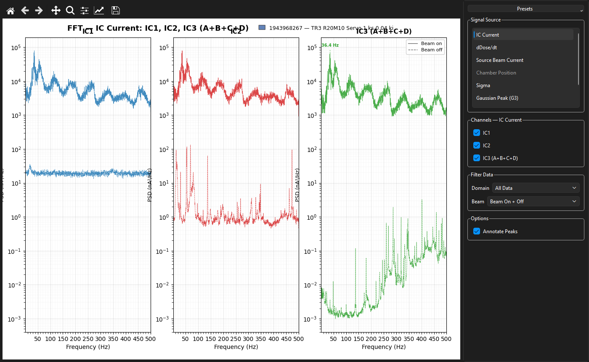
  <br>
  <sub><em>Magnetic field replay (G3 hall probes) and FFT Explorer spectra.</em></sub>
</p>

<p align="center">
  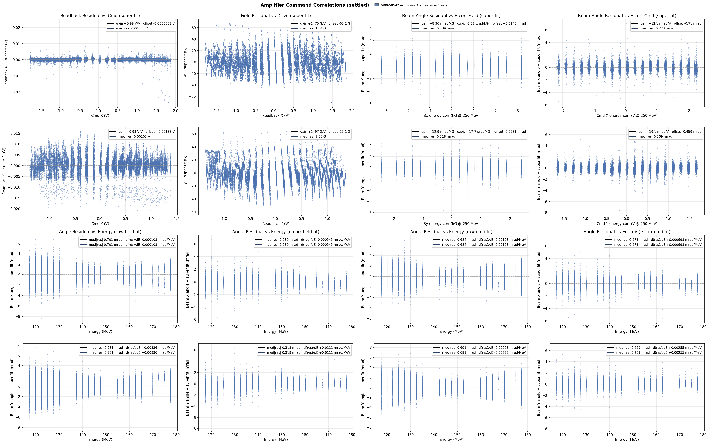
  &nbsp;
  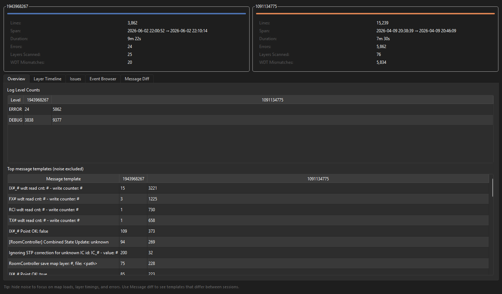
  <br>
  <sub><em>Amplifier command correlations (G2 steering chain) and Session Log Compare.</em></sub>
</p>

## The launcher

Scan Kit opens a single window with five tabs. **View** switches tabs (`Ctrl+1` to `Ctrl+5`) and sets **Theme** (System / Light / Dark). **Analysis** opens the same views as the Data Analysis buttons. **File** opens or refreshes the session folder. **Esc** or **Ctrl+Q** quits.

| Tab | Shortcut | Use it to |
|-----|----------|-----------|
| **Data Analysis** | `Ctrl+1` | Browse sessions, adjust global plot settings, and open analysis views |
| **Plan Synthesis** | `Ctrl+2` | Create PBS test plans and export `input_map.csv` |
| **Plan Runner** | `Ctrl+3` | Connect to an RCI, upload a plan, run it, and download the session |
| **Configuration Tuning** | `Ctrl+4` | Open a facility or session config folder, edit XML, run tuning workflows |
| **Debug** | `Ctrl+5` | Live launcher and view-process logs, with Copy / Clear for support |

Plot windows open separately. Close them when you are done. The launcher keeps running.

## Data Analysis

### 1. Choose your data source

Paste a folder, Windows UNC share (`\\server\share\...`), or URL such as `sftp://user@host/var/log/ptc_ex` into the path field (placeholder: *Folder, UNC, or sftp://user@host/path*). **Browse...** can pick local and UNC/Network folders; on Linux desktops whose file dialogs speak GVfs/KIO it can pick `sftp://` and `smb://` too. Windows Explorer does not speak SFTP, so those URLs are still pasted. Press **Enter**, click away, or hit **↻** / **File → Refresh Sessions** to rediscover.

SFTP uses SSH keys or the agent first. If those fail, Scan Kit prompts for a password and keeps it in memory until the app exits (never sqlite). Opening a remote session copies it into `~/.scan-kit/remote-cache`; **File → Clear Remote Cache…** (and Debug) shows the size and deletes that folder. List/open failures show under the path field and in Debug. The last location is remembered in `~/.scan-kit`. When running a frozen executable with no remembered folder, the default is the folder that contains the executable.

### 2. Select sessions

The session table shows **Use**, **Session ID**, **Date**, **MU**, **Time**, **RM**, **Config**, and **Note**. Selected rows get a plot-color swatch so overlays match the views.

- Sort by **Date** (newest first), **ID**, **Config**, or **MU**
- Tick **Use** on up to **five** sessions; no modifier key needed
- Click **✕** to clear all selections
- **Right-click** a session → **Copy Session ID**, **Move to Recycle Bin...** (or **Delete from remote host...**), or **Open in Config Tuning...** when a config folder is available

Remote deletes are permanent (no recycle bin on the host). Local sessions go to the OS Recycle Bin / trash and can be restored from there.

### 3. Annotate sessions (optional)

Double-click (or press **F2** on) the **Note** column to add free-text notes. **Edit → Undo / Redo** covers note edits. Notes, plot settings, window geometry, theme, and the last data folder are stored in `~/.scan-kit/scan-kit.sqlite` so they survive app updates and do not depend on where Scan Kit is installed. Older `app_settings.json`, `session_notes.json`, and `<data_source>/settings.json` files are imported once, then left as a snapshot.

### 4. Tune global settings

Two controls affect most dose-related views:

| Setting | Options |
|---------|---------|
| **BG Subtraction** | Off / On |
| **Calibration** | Off · Per-Session · Constrained |

Settings persist in `~/.scan-kit/scan-kit.sqlite` and propagate to views that are already open. These plot-calibration modes never write `devices.xml`. That is **Dose Calibration** on the Configuration Tuning tab.

### 5. Open analysis views

Click any button in the right-hand panel, or use **Analysis** in the menu bar. **Unified Views** and **Specialized Analysis** are the two launcher groups. Each view runs in a background subprocess; a warm worker pool makes the first click feel snappy.

## Analysis views

Views are organized in the launcher as **Unified Views** (configurable Qt explorers with a side panel of metrics, presets, and filters) and **Specialized Analysis** (focused matplotlib tools not yet folded into a unified shell).

### Unified views

Configurable Qt shells for the metrics most sessions need day to day.

| View | Summary |
|------|---------|
| Binned Summary | Box / violin / mean / scatter / contour summary. Pick **Y metric** (dose error, dose ratios, dose rate, current ratios, IC current, position error, sigma, sigma error, IC2-IC1 position, spot time) and **X parameter** (energy, target MU, spot time, beam radius). **Filter Data** includes beam on/off/both plus All Data / Within Lower 95% / Upper 5% Only / MAD Outliers. Optional interlock-threshold overlay on dose-vs-MU plots. |
| Distribution Explorer | Density contours or scatter of position, position error, sigma, sigma error, IC2-IC1 position, confidence correlations, and Gaussian filter coverage, at spot or timeslice grain. |
| Timeslice Replay | Interactive multi-channel timeslice viewer. See [details](#interactive-replay-views) |
| FFT Explorer | Frequency-domain line spectra for timeslice IC current, dDose/dt, source beam current, chamber position, sigma, G3 Gaussian peak, magnetic field, and amplifier command/readback. |
| Audio Explorer | Listen to the same timeslice families, with transport, a live playhead FFT, and **Save WAV** *(needs a working audio device / PortAudio)* |
| IC Beam Trajectory (3D) | Per-spot IC beam paths in 3D with plan overlay, dipole pivots, and iso/IC planes (visPy) |
| Dose Volume (3D) | Ray-marched dose from IC, ISO-ray, or plan spots. Compare measured, measured minus plan, or 3D gamma, in water, plastic, or metal. See [details](#dose-volume-3d) |
| Session Log Compare | Layer timings, grouped errors, event browser, two-session diff. See [details](#session-log-compare) |

For position scatter, position-error outliers, beam-on/off IC current histograms, and most dose/position/sigma summaries, start with **Binned Summary** or **Distribution Explorer** instead of opening a dedicated legacy plot.

### Dose Volume (3D)

Builds a 1 mm dose volume from the measured spot or timeslice Gaussians and ray-marches it. Position can come from IC1, IC2, the ISO ray between them, or the plan. When a plan is loaded, **Compare** switches among the measured volume, measured minus plan, and a 3D gamma map scored the AAPM TG-218 way. **Quantity** is dose in Gy along the Bragg curve, or where monitor units or protons stop.

**Model** picks how each spot deposits dose. **Analytic** is the fast Gaussian fill. **Monte Carlo** transports proton histories on the GPU with the physics of [MCsquare](https://gitlab.com/openmcsquare/MCsquare) (Class II condensed history, energy-loss straggling, multiple Coulomb scattering, nuclear elastic, inelastic and proton–proton interactions, secondary protons transported) and needs an OpenGL 4.3 GPU. It is offered for **Dose** in water, PMMA, polystyrene, aluminum and copper, the media with MCsquare stopping and nuclear data. **Histories** sets the total simulated for the volume. More histories take longer but are less noisy. The volume fills in progressively. A noisy first picture appears at once and sharpens as histories add up, and you can rotate and zoom the view throughout. A thin bar across the top of the view shows how far the run has got. Raising Histories carries on from the histories already run, while lowering it below what's done starts over. Gamma and the field bounds wait for the finished run. The note under the view gives the ± statistical uncertainty in the high-dose region and the share of energy that left the grid, so widen the grid if that share is large. Measured and plan are simulated with the same random numbers, so their difference and gamma show the delivery rather than the noise. The Monte Carlo already includes scatter in the phantom, so the **Scatter** option is disabled in that mode.

**Beam** sets the energy spread and the plan spot size: this session per layer, another loaded session, or the interlock. Measured spots keep the logged chamber σ. Scatter in the phantom widens measured and plan together. **Phantom** picks the medium (water, PMMA, polystyrene, polyethylene, A-150, aluminum, or copper), the thickness, and any entrance water-equivalent thickness. **Field Bounds** reports the field size, by default the lateral 50% edge on each slice (ICRU 78), with options for the high-dose core and the planned 90% volume. **View** sets the gantry angle, whether a ray integrates, keeps its maximum, or fades, the voxel size, and nearest, linear, or cubic sampling. See the [screenshot](#screenshots).

### Specialized analysis

Focused plots that still use standalone matplotlib windows:

| View | Summary |
|------|---------|
| Beam Error Motion vs Energy | Per-energy position-error spill paths (IC1 solid, IC2 dotted) |
| Dose Accumulation | Expected vs measured cumulative dose per chamber |
| Beam-Off Ramp-Down | Beam-off current ramp-down curves (IC1/IC2/IC3) |
| IC HV Transient Test | IC high-voltage toggle transients with capacitance re-derived from waveforms |
| Amplifier Command Correlations | Settled amplifier command vs readback, field, and IC iso position. See [details](#amplifier-command-correlations) |
| IC Peak Amplitude - Beam-Off (G3) | G3 beam-off peak amplitude distributions |

### Interactive replay views

**Timeslice Replay** opens a Qt window with an embedded Matplotlib plot and a unified **Signal Source** list (same metric names and isocenter/chamber variants as Binned Summary and Distribution Explorer where applicable). Sources include **IC current**, **dDose/dt**, **sigma**, **sigma error**, **position**, **position error**, **IC2-IC1 position**, and **magnetic field**. Presets jump to common sets; pick channels within the selected source from the checklist below. Detail traces sit above a compressed timeline brush. See the [screenshots](#screenshots) for examples.

1. Select session(s) and open **Timeslice Replay**.
2. Choose a signal source from the list (or use a preset), then tick the channels to plot.
3. Drag the bottom timeline brush to set the detail window (scroll to zoom).

Layer boundaries appear as annotated vertical lines. Multiple sessions overlay with distinct colors. Large windows are auto-decimated so scrubbing stays smooth.

Optional toggles: background subtract, peer overlay (single-session), beam-off edges, digital lanes, and beam-current twin axis.

**Magnetic field** channels plot scan-magnet probes in gauss:

- **G3:** `r_tx2_probe_x` / `r_tx2_probe_y` (TX2 hall probes)
- **G2:** `field_c_x` / `field_c_y` (correcting-coil readback)

Selecting field channels shows a Bx-vs-By scatter panel (colored by energy) beside the timeline.

### Amplifier command correlations

For G2 correcting-coil sessions, this view plots beam-on samples where amplifier commands have reached a settled plateau. Scatter panels relate command to readback, magnetic field, and IC iso position, useful for diagnosing steering-chain consistency end to end.

### Session log compare

Every session ships a verbose `SessionLogFile.log` from DCS. This view distills it:

1. Select **one** session to explore, or **two** to compare.
2. **Layer timeline:** `START MAP` and `SCAN EXECUTING` durations per layer.
3. **Issues:** grouped `ERROR` templates and watchdog mismatches.
4. **Event browser:** filterable log with *Hide noise* to skip ACK/command chatter.
5. **Message diff** *(two sessions):* templates whose occurrence counts differ most.

## Plan Synthesis

Switch to the **Plan Synthesis** tab (`Ctrl+2`) to build `input_map.csv` files for PBS test plans.

| Template | Description |
|----------|-------------|
| **Zero Field** | Every spot at (0, 0) for each energy layer |
| **Rectangular Field** | Even spot grid per layer with configurable field size |
| **DICOM RT Plan** | Import an RT Ion therapy plan (`.dcm`) |
| **IBA PLD Plan** | Import an IBA PBS plan (`.pld`) |

Pick a template, set parameters, preview the spot table, and export. Suggested filenames are generated from the template and energy settings. **Plan Runner** can upload the saved CSV to an RCI.

<p align="center">
  
</p>

## Plan Runner

The **Plan Runner** tab (`Ctrl+3`) is the operator console for an RCI:

1. Enter the RCI IP (or a browser URL such as `http://192.168.100.184/io/`) and **Connect**. The last host is remembered.
2. **Browse...** to an `input_map.csv` from Plan Synthesis and **Upload to RCI**.
3. **Start** / **Pause** / **Stop** / **Reset** follow the controller ready-permit. Start enables when the RCI grants permit.
4. After the run, **Download** saves a G3-layout session zip under `/root/reports/session/` on the RCI so Data Analysis can open it like any other session.

Live tiles show control point, energy, layer, elapsed time, start permit, and whether the uploaded points were accepted.

<p align="center">
  
</p>

## Configuration Tuning

The **Configuration Tuning** tab (`Ctrl+4`) is a structured editor for map2map XML configuration:

- **File tree:** browse `devices.xml` and related config files
- **Auto-generated forms:** edit XML values without raw markup
- **Hide unused map2map XML:** collapse attributes the map2map library never reads
- **Integrity badges:** SHA-256 sidecar verification at a glance
- **Auto-tuning workflows:** **Sigma Tuning**, **Position Offset Tuning**, **IC Distance Tuning**, and **Dose Calibration** derive updated `devices.xml` values from measured sessions, with preview before apply

Jump here directly from a session's context menu in Data Analysis when an on-disk config folder exists.

### Ion chamber magnification

Strip readings become millimetres at isocenter through a magnification factor that map2map computes as:

```
source_to_isocenter_distance (scan_dose_system.xml)  /  source_to_device_distance_mm (devices.xml)
```

The per-chamber `source_to_axis_distance_mm` looks like it should be the numerator, but map2map parses it only to seed that factor and then overwrites it for every chamber with the single system-wide `source_to_isocenter_distance`. Room configs often disagree between the two (or carry placeholder values), which has no effect on delivery. Field tooltips in the editor spell out which fields are live, which are overwritten, and which are only range-checked at load.

### Position tuning: offset vs distance

Two workflows correct IC positions, and they are the same model with one parameter freed:

| Workflow | Writes | Corrects |
| --- | --- | --- |
| **Position Offset Tuning** | `zero_offset_at_iso_mm` | a constant shift, whatever the distance from isocenter |
| **IC Distance Tuning** | `source_to_device_distance_mm` and `zero_offset_at_iso_mm` | a shift *plus* an error that grows with distance from isocenter |

IC Distance Tuning assumes delivery at isocenter is correct and the chamber is mis-scaled, then fits both together, since `source_to_device_distance_mm` is the only per-chamber scale knob map2map honours. Fitting them jointly matters because an offset fitted against a wrong scale absorbs part of the scale error, so use Position Offset Tuning only when the scale is trusted.

Because it moves a *surveyed* distance, the workflow needs spot data from a plan that actually spans the field, reports each proposed change against its own fit uncertainty, and refuses changes the data cannot support. Per-spot scatter alone will fit a small scale error on any real session, so a change smaller than a few sigma is flagged rather than trusted. Changing the distance also rescales isocenter sigma by the same factor, so re-run Sigma Tuning afterwards.

Gross outliers are rejected before fitting: a dropped spot pulls the fitted scale in proportion to both its error and its distance from the field centre, so one bad spot at a field edge is the worst case. The rejected count appears in the preview and is called out when it exceeds a stray few, since a session shedding many spots is a data problem rather than a calibration one. Rejected spots stay in the reported residuals so they remain visible.

Read the preview by these columns:

| Column | Means |
| --- | --- |
| **Systematic** | position error at the worst field edge that the change removes, which is the reason to apply it |
| **RMS err** | what the fit minimises, so the honest before/after |
| **Max \|err\|** | a single worst spot; it can *rise* when correcting a systematic of opposite sign stops masking an outlier |

### Dose calibration: kMU

`K_MU` on each ion chamber (`gain_conversion` with `in_units="MU"`) is coulombs per monitor unit. map2map converts `MU = Q / K_MU`; session `ic*_total_dose_spot` columns are already in MU.

If the primary IC is the beam terminator, its reported MU already matches `CHARGE_REQ` by construction. Matching primary `K_MU` to the plan would be circular and would not change dose at isocenter. **Dose Calibration** therefore:

- leaves primary `K_MU` unchanged by default
- scales every secondary IC family so it would have reported the same total MU as the primary on the selected deliveries
- optionally rescales the primary first, either to a known MU delivered at isocenter (Faraday / iso chamber, total for the selected sessions combined) or by a percentage of reported MU

Positive percent means more reported MU / more delivered charge for the same prescription, so `K_MU` decreases (`+2%` → scale `1/1.02`). Changing primary `K_MU` changes future delivered charge for the same `CHARGE_REQ`; secondary-only applies align reporting and interlocks, not absolute dose.

HCC and strip devices in one IC family keep their relative `K_MU` and all move by the same factor. Large commissioning corrections are allowed; the preview warns above 5% rather than blocking the write. This is not Data Analysis plot calibration (`per_session` / `constrained`), which never writes `devices.xml`.

<p align="center">
  
</p>

## Session data layout

Scan Kit discovers sessions from a single data-source folder. That can be a local directory, a UNC share, or an fsspec URL (`sftp://`, `smb://`, `ftp://`, `ssh://`/`scp://` as SFTP aliases, ...). Supported layouts:

**Unpacked directories**

```
<data_source>/
  <session_id>/
    input_map.csv
    SessionLogFile.log          # optional: session log views
    layer-<n>/run-<m>/
      timeslice_data_device_units.csv   # timeslice views
```

A nested layout (`<session_id>/<session_id>/input_map.csv`) is also recognized.

**Archive files:** each archive should contain a top-level `<session_id>/` folder:

`.zip` · `.tgz` · `.tar.gz` · `.tar.bz2` · `.tar.xz` · `.tar`

Session-list metadata is cached in `~/.scan-kit` so the table can fill without extracting every archive. Opening a view still unpacks (or copies a remote session into `~/.scan-kit/remote-cache`, with a progress dialog) as needed.

---

## For developers

Day-to-day work merges into **`develop`**. `main` is the release line. Open pull requests against `develop` (`gh pr create --base develop`). The only PR that should target `main` is promoting `develop` for a release.

CI fails feature PRs that target `main`.

<details>
<summary><strong>Regenerating README screenshots</strong></summary>

Screenshots in `docs/images/` are captured from real session data with:

```bash
python scripts/capture_doc_screenshots.py
```

Requires a local `test_data/` folder (not shipped with the repo). The script grabs launcher tabs and unified view windows off-screen (dark theme for the grab only; it does not persist **View → Theme**), generates a compact Zero Field preview for Plan Synthesis, and renders the remaining specialized matplotlib view headlessly.

</details>

<details>
<summary><strong>Running tests</strong></summary>

```bash
pip install -e ".[build,dev]"
pytest
```

Tests live in `tests/` and use fixtures from `test_data/` (included in dev installs, excluded from the published package). The suite runs headless (Agg matplotlib backend, no Qt windows). Default `pytest` skips `@pytest.mark.slow` tests; `pytest -m slow` runs the heavy session/Qt cases.

App preferences (window geometry, last data directory, plot settings, session notes, theme) persist in `~/.scan-kit/scan-kit.sqlite`.

</details>

<details>
<summary><strong>Validating the GPU Monte Carlo against MCsquare</strong></summary>

MCsquare is the only reference for the GPU Monte Carlo. Its source and material data are a submodule in `third_party/MCsquare`:

```bash
git submodule update --init third_party/MCsquare
```

`scan_kit/assets/mc_materials.npz` packs the stopping-power, scattering and nuclear tables that the shader reads from `third_party/MCsquare/Materials`. After the submodule changes, rebuild it with `python scripts/build_mc_tables.py`.

`pytest` doesn't compare against MCsquare. `tests/test_dose_mc.py` checks the engine against itself: tables, energy bookkeeping, determinism, spot placement, and range against its own stopping powers. These tests need an OpenGL 4.3 context and skip without one. MCsquare agreement lives in `validation/mcsquare_validate.py`, which you run by hand after changing the Monte Carlo physics. It has two suites:

- **fast** (about 30 s): five small, awkward cases at 1e6 GPU histories with looser tolerances. They cover a 1 mm spot, copper at 70 MeV, a water-to-aluminum interface, nuclear build-up at 180 MeV, and three off-axis spots of mixed energy and weight in PMMA.
- **full** (about 10 min): the fast cases plus water from 70 to 230 MeV at two spot sizes, each other Monte Carlo medium, an entrance WET and a 245-spot field, all at 1e7 histories. The field runs 4× the histories because it spreads them over far more voxels.

Each case reports the integrated depth dose, R80, lateral σ at three depths, total energy, dose centroid and a 3D gamma. A check runs only the GPU. MCsquare's result for every case is cached in `validation/goldens/` as its summaries plus the dose around the beam.

```bash
python validation/mcsquare_validate.py fast
python validation/mcsquare_validate.py full
python validation/mcsquare_validate.py full --case water_150_s3 --histories 1e6
MCSQUARE_DIR=/path/to/MCsquare python validation/mcsquare_validate.py full --write-goldens
```

`--write-goldens` reruns MCsquare, at 1e7 primaries by default, and replaces the cache. You only need it after changing a case or updating MCsquare. `MCSQUARE_DIR` is either the folder holding `MCsquare_win.exe`, `MCsquare_linux` or `MCsquare_mac`, or the executable itself.

Deliberate MCsquare 1.1 behaviours kept in the port:

- The nuclear cross-section index wraps above 249 MeV.
- ICRU inelastic data apply only between 7 and 249 MeV.
- No proton–proton interactions at or below 10 MeV.
- The last inelastic angle bin samples the forward hemisphere, which is what MCsquare's out-of-range table read produces.

</details>

<details>
<summary><strong>Building an executable locally</strong></summary>

```bash
pip install -e ".[build]"
python build.py --clean      # single-file executable → dist/
python build.py --onedir     # faster one-directory bundle for iteration
```

Output: `dist/scan-kit` (Linux) or `dist/scan-kit.exe` (Windows). Local builds keep these generic names; CI release assets include the version suffix.

</details>

<details>
<summary><strong>Cutting a release</strong></summary>

Releases are automated via [`.github/workflows/build.yml`](.github/workflows/build.yml).

1. Bump `__version__` in `scan_kit/__init__.py`, the single source of truth, also read by `pyproject.toml` and the window title.
2. Commit: `Release vX.Y.Z`, merge to `develop`, then promote `develop` → `main` (or release directly from `main` once aligned).
3. Tag and push:

```bash
git tag vX.Y.Z
git push origin vX.Y.Z
```

| Trigger | CI output |
|---------|-----------|
| Pull request to `main` or `develop` | Tests only (no executable build) |
| Push to `main` or `develop`, manual dispatch | Tests, then `-rc` artifacts (`scan-kit-windows-X.Y.Z-rc.exe`, etc.) |
| `v*` tag push | Tests, build, and GitHub Release with `scan-kit-windows-X.Y.Z.exe` and `scan-kit-linux-amd64-X.Y.Z.AppImage` |

Day-to-day work merges feature branches into **`develop`** first; `main` tracks released (or release-ready) history. Open a pull request against `develop`, not `main`, unless you are promoting a release.

CI verifies the tag matches `__version__` before publishing. The project follows [Semantic Versioning](https://semver.org/).

</details>

## License

[MIT](LICENSE). Copyright (c) 2026 Pyramid Technical Consultants

The Monte Carlo physics and material data are ported from [MCsquare](https://gitlab.com/openmcsquare/MCsquare), Université catholique de Louvain, under the Apache License 2.0 ([`scan_kit/assets/MCsquare_LICENSE.txt`](scan_kit/assets/MCsquare_LICENSE.txt)).
